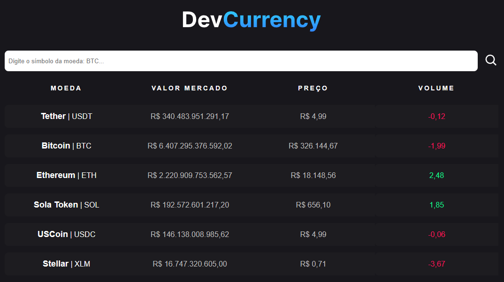

<hr>

### Tópicos

- [Descrição do projeto](#descrição-do-projeto)

- [Funcionalidades](#funcionalidades)

- [Layout](#layout)

- [Ferramentas utilizadas](#ferramentas-utilizadas)

- [Acesso ao projeto](#acesso-ao-projeto)

- [Abrir e rodar o projeto](#abrir-e-rodar-o-projeto)

- [Desenvolvedor](#desenvolvedor)

## Descrição do projeto

<p align="justify">
 Projeto desenvolvido para exibir as informações mais relevantes das principais moedas digitais, através do consumo de uma API.



</p>

## Funcionalidades

:heavy_check_mark: `Funcionalidade 1:` Exibir dados das principais moedas digitais, de forma automática, e sendo atualizadas em tempo real.

:heavy_check_mark: `Funcionalidade 2:` Formatar dados trazidos pela api para o formato real brasileiro, exibindo-os conforme uma lista.

:heavy_check_mark: `Funcionalidade 3:` Campo de busca para pesquisar a moeda desejada.

:heavy_check_mark: `Funcionalidade 4:` Ao clicar na moeda digital, abre uma nova página com dados mais detalhados sobre a mesma.

## Layout

<div align="center">


  </div>

###

## Ferramentas utilizadas

      </a>

- React
- TypeScript
- JavaScript
- CSS
- HTML
- Git

###

## Acesso ao projeto

Você pode [acessar o site do projeto](https://search-cripto-dias.vercel.app/).

## Abrir e rodar o projeto

```cmd
# Clone este repositório
git clone <link do repositório>

# Acesse a pasta do projeto no seu terminal
cd search_cripto

# Execute a aplicação
npm run dev
```

## Desenvolvedor

[<br><sub>Bruno Dias de Freitas</sub>](https://github.com/diasbrunodev)
